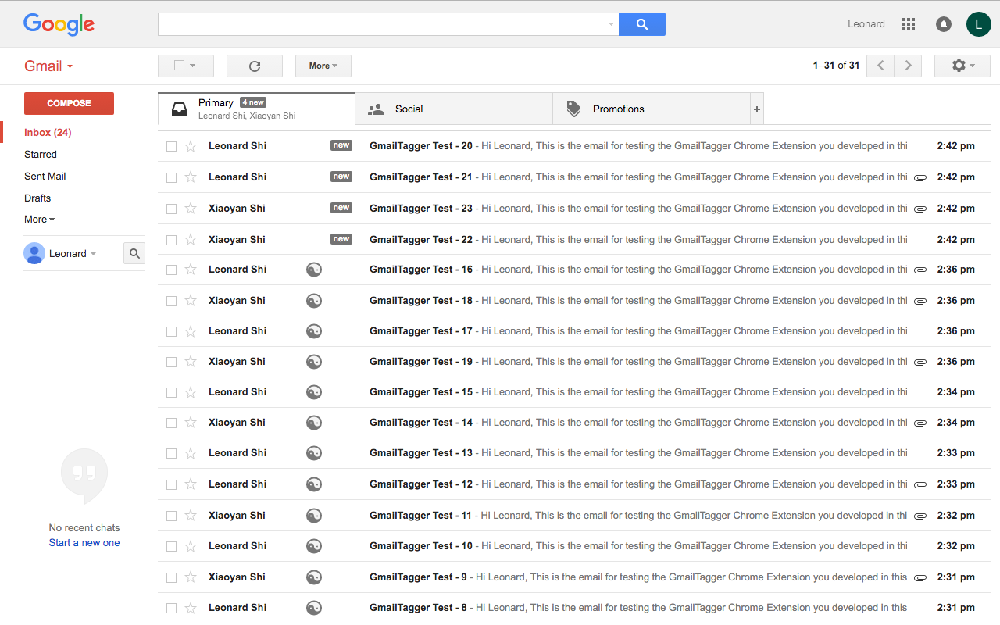
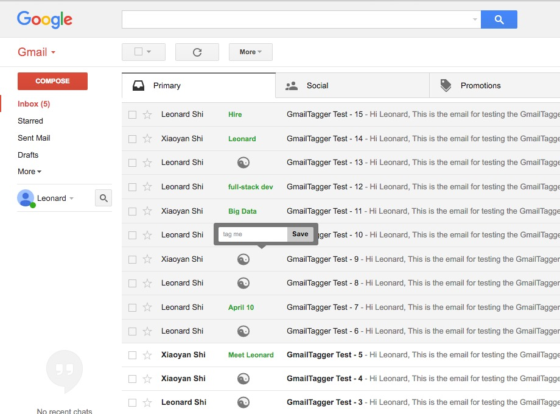

## Description

- This is a Google Chrome extension for Gmail.

- With it you will be able to:

  - Tag the emails in your Gmail inbox as you wish.

  - Take a glance to know what you had planned to do to this email before.

  - Your tags will be synced according to your Gmail account, anywhere you can see it.

## How to get and install

- Open this link [Gmail Tagger](https://chrome.google.com/webstore/detail/gmail-tagger/dlgkcajandmbfigoefogakpnnhajocjp) and add the extension to your Chrome.

- Go back to your Chrome browser, and **open(refresh)** your Gmail inbox page, then you are ready to enjoy this extension.

## User guides

- It is very easy and convenient to use, I just put some screenshots here, anyone should be able to know how to use it.

- After you added this extension to your chrome, then refresh the Gmail inbox page you will see:

  - 

- Click on the **_Yin and Yan** icon_, you will be able to add tag, as follows:

  - 

## Why build this extension?

- Lets say you got 50 emails in your inbox in one page, though perhaps all emails have its own title:

  - It is still a bit hard to just take a glance to find out the exact conversation you are looking for.

  - Some email titles are not that explicit to you.

  - You want to remark or add a quick tag(note) to one email, so in the future you can know what you had planned to this email by just taking a glance.

- This extension is for solving the above problems, for you to use Gmail more efficiently.

## Support and new features request

- For any issue and new feature request, please submit your ticket at: [Issues & New Feature Request](https://github.com/lnshi/gmail-tagger/issues), I will get to that ASAP.

